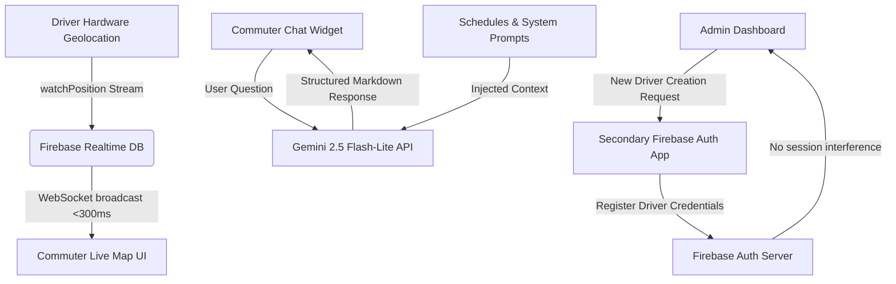

# GreenRoute — Intelligent Transit & Fleet Management System

[](https://firebase.google.com/)
[](https://react.dev/)
[](https://leafletjs.com/)
[](https://deepmind.google/technologies/gemini/)

**GreenRoute** is a serverless, real-time fleet management and passenger information platform custom-built for the **Sargodha Electric Bus Service**. Developed as a BSCS Capstone Project, it resolves critical public transit unpredictability by delivering sub-second real-time tracking, intelligent ETA estimations, and an automated conversational AI assistant—all operating under a zero-cost open-source mapping infrastructure.

---

## 🚀 Key Engineering & Architecture Highlights

### 1. Zero-Cost Leaflet & OpenStreetMap (OSM) Migration
*   **The Problem:** Google Maps API costs scale linearly with map loads and routing calculations, presenting a heavy financial barrier for university projects and public utilities.
*   **The Engineering Solution:** Migrated the entire GIS architecture to open-source **Leaflet.js** and **OpenStreetMap (OSM)** raster tiles. This eliminated 100% of mapping API costs while preserving fluid, high-fidelity map interactions on both desktop and mobile browsers.

### 2. Intelligent Custom ETA System (Haversine & Urban Tortuosity)
*   **The Problem:** Without paid routing engines like Google Directions API, simple straight-line calculations drastically underestimate real-world road arrival times.
*   **The Engineering Solution:** Built an in-house ETA computation pipeline:
    *   **Geodesic Distance:** Utilizes the **Haversine Formula** to determine the great-circle distance between the active bus and the commuter's selected stop.
    *   **Urban Tortuosity Factor:** Multiplies straight-line results by a grid-expansion constant of **1.35** (matching Sargodha's urban layout grid) to emulate actual road distance.
    *   **Final ETA Estimation:** Combines calculated road distance with average electric bus city speeds ($25 \text{ km/h}$) to deliver precise, sub-minute arrival estimates at zero cost.

### 3. Serverless Real-Time Telemetry Data Flow
*   **WebSocket Core:** Pushed location updates from driver mobile hardware directly to **Firebase Realtime Database (RTDB)**. Commuter browsers listen via active WebSockets (`onValue`), resulting in sub-300ms end-to-end telemetry update latency.
*   **State Optimization:** Implemented strict memoization (`useMemo`, `React.memo`) to separate static map assets from high-frequency marker coordinate updates, maintaining a constant 60 FPS UI performance during rapid broadcasts.

### 4. Admin Security: The Secondary Firebase App Pattern
*   **The Problem:** Firebase Client Auth normally forces a logout of the current user session (the Admin) whenever a new user (a Driver) is successfully created.
*   **The Engineering Solution:** Engineered a custom initialization script that builds a temporary, secondary Firebase App instance. This allowed the Admin to safely register new drivers without compromising or terminating their own secure session.

### 5. Context-Guided Gemini AI Transit Assistant
*   **Model:** Integrated **Gemini 2.5 Flash-Lite** via direct REST payload streaming.
*   **Context Scope:** Fed the live Sargodha bus timetables, fares, and route coordinates into the AI's prompt space.
*   **System Prompt Hardening:** Strictly bounded the LLM to only answer transit-related queries and gracefully handle rate limits (`HTTP 429`), blocking off-topic conversations (e.g., general programming, politics) and presenting a reliable virtual transit agent.

---

## 🛠️ Technology Stack
*   **Frontend Core:** React 18, TypeScript, Vite
*   **UI/UX:** Tailwind CSS, Shadcn UI, Framer Motion
*   **Mapping:** Leaflet, React-Leaflet, Turf.js
*   **Backend & DB:** Firebase Auth (RBAC), Cloud Firestore, Firebase RTDB
*   **AI Integration:** Gemini API (Google AI SDK / REST)
*   **State Management:** TanStack React Query, React Context

---

## 🗺️ System Data Flow Architecture


---

## ⚙️ Development Setup

### Prerequisites
*   Node.js (v18 or higher)
*   NPM / PNPM

### Installation

1. Clone the repository:
   ```bash
   git clone https://github.com/Asma-Khanum1722/greenroute-webapp.git
   cd greenroute-webapp
   ```

2. Install dependencies:
   ```bash
   npm install
   ```

3. Configure your Environment Variables by creating a `.env` file in the root folder:
   ```ini
   VITE_FIREBASE_API_KEY="your_firebase_api_key"
   VITE_FIREBASE_AUTH_DOMAIN="your_firebase_auth_domain"
   VITE_FIREBASE_DATABASE_URL="your_firebase_database_url"
   VITE_FIREBASE_PROJECT_ID="your_firebase_project_id"
   VITE_FIREBASE_STORAGE_BUCKET="your_firebase_storage_bucket"
   VITE_FIREBASE_MESSAGING_SENDER_ID="your_firebase_messaging_sender_id"
   VITE_FIREBASE_APP_ID="your_firebase_app_id"
   VITE_GEMINI_API_KEY="your_gemini_api_key"
   ```

4. Start the local development server:
   ```bash
   npm run dev
   ```

---

## 👥 Capstone Project Contributors
*   **Asma Khanum** (Lead Developer — Geolocation, Mapping Architecture & UI System)
*   **Mahnoor** (Database Specialist — Cloud Datastores & Security Schemas)
*   **Wajeeha Safdar** (AI Integration Specialist — LLM Optimization & Prompt Engineer)

---

## ⚖️ License
This project was developed as a BSCS Graduation Capstone Project for the Department of Computer Science. All rights reserved.
